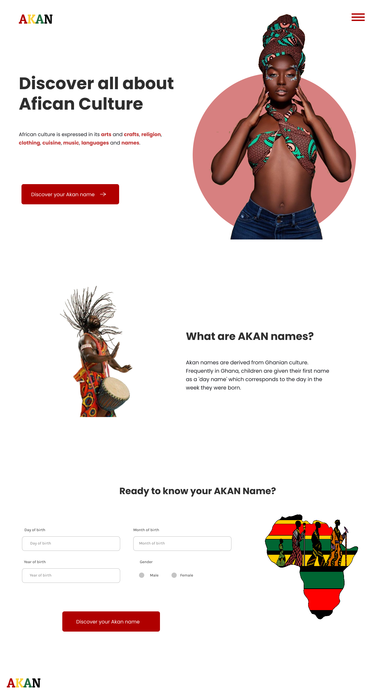
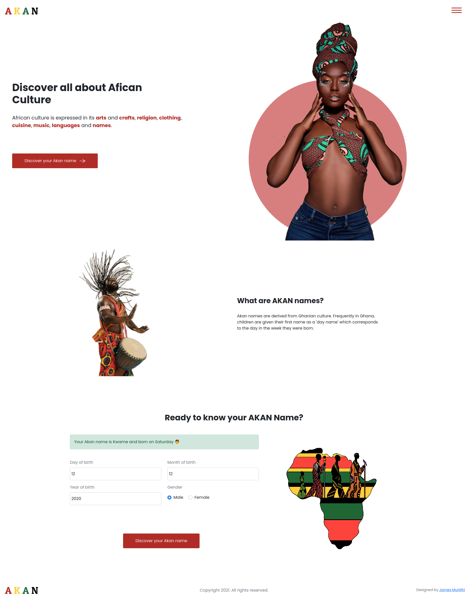

# Akan Names
African culture is expressed in its arts and crafts, religion, clothing, cuisine, music, languages and names.


## Description
Akan names are derived from Ghanian culture. Frequently in Ghana, children are given their first name as a 'day name' which corresponds to the day in the week they were born.

## Technologies Used
* HTML
* CSS
* JS

## How it works
1. Enter your day of birth
1. Enter your month of birth
1. Enter your year of birth
1. Select your gender
1. Click on discover your akan name button
1. Displays your Akan Name 🎉

## How to setup

1. Download or clone the project
```shell
foo@bar: ~$ git clone https://github.com/james-muriithi/akan-names.git
```
2. Navigate to the cloned or downloaded folder
1. Open index.html file with your browser

## Design
[Here is link to the design](https://www.figma.com/file/Qdvqwoo5AQCCqeMYuXiksz/Akan-Names?node-id=0%3A1)



## Demo
[Here is link to the site](https://james-muriithi.github.io/akan-names/)

## Screenshot


## License
Copyright (c) 2021 Moringa school

Permission is hereby granted, free of charge, to any person obtaining a copy
of this software and associated documentation files , to deal
in the Software without restriction, including without limitation the rights
to use, copy, modify, merge, publish, distribute, sublicense, and/or sell
copies of the Software, and to permit persons to whom the Software is
furnished to do so, subject to the following conditions:

The above copyright notice and this permission notice shall be included in all
copies or substantial portions of the Software.

THE SOFTWARE IS PROVIDED "AS IS", WITHOUT WARRANTY OF ANY KIND, EXPRESS OR
IMPLIED, INCLUDING BUT NOT LIMITED TO THE WARRANTIES OF MERCHANTABILITY,
FITNESS FOR A PARTICULAR PURPOSE AND NONINFRINGEMENT. IN NO EVENT SHALL THE
AUTHORS OR COPYRIGHT HOLDERS BE LIABLE FOR ANY CLAIM, DAMAGES OR OTHER
LIABILITY, WHETHER IN AN ACTION OF CONTRACT, TORT OR OTHERWISE, ARISING FROM,
OUT OF OR IN CONNECTION WITH THE SOFTWARE OR THE USE OR OTHER DEALINGS IN THE
SOFTWARE.